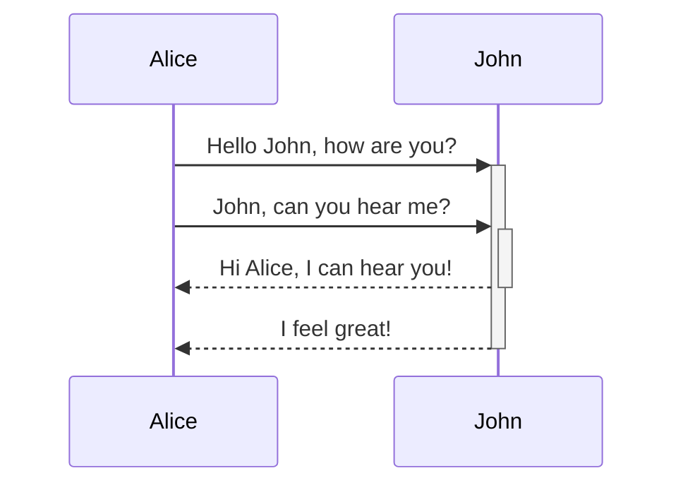
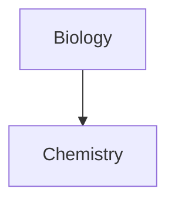

---
tags:
  - "#tags"
  - "#sub/tags"
title: Style Reference
date: 2026-04-16
aliases:
  - style-preview
  - theme-specimen
cssclasses:
  - style-reference
---

# Style Reference

This page serves as a comprehensive preview of all styled elements. Every theme preview site includes this page to showcase how the theme renders each element.

---

# Heading 1

## Heading 2

### Heading 3

#### Heading 4

##### Heading 5

###### Heading 6

---

## Text Formatting

Text text [external link](https://example.com) text [[callouts|internal link]] text **bold text** text _italic text_ text **_bold and italic text_** text ==highlighted text== text ~~strikethrough text~~ text.[^1]

| Style                  | Syntax                 | Example                                  | Output                                 |
| ---------------------- | ---------------------- | ---------------------------------------- | -------------------------------------- |
| Bold                   | `** **` or `__ __`     | `**Bold text**`                          | **Bold text**                          |
| Italic                 | `* *` or `_ _`         | `*Italic text*`                          | _Italic text_                          |
| Strikethrough          | `~~ ~~`                | `~~Striked out text~~`                   | ~~Striked out text~~                   |
| Highlight              | `== ==`                | `==Highlighted text==`                   | ==Highlighted text==                   |
| Bold and nested italic | `** **` and `_ _`      | `**Bold text and _nested italic_ text**` | **Bold text and _nested italic_ text** |
| Bold and italic        | `*** ***` or `___ ___` | `***Bold and italic text***`             | **_Bold and italic text_**             |

---

## Blockquotes

> Human beings face ever more complex and urgent problems, and their effectiveness in dealing with these problems is a matter that is critical to the stability and continued progress of society.

- Doug Engelbart, 1961

---

## Lists

### Unordered List

- First list item
- Second list item
- Third list item

### Ordered List

1. First list item
2. Second list item
3. Third list item

### Nested List

1. First list item
   1. Ordered nested list item
2. Second list item
   - Unordered nested list item

### Task List

- [x] This is a completed task.
- [ ] This is an incomplete task.
- [?] Question
- [-] Cancelled
- [>] Deferred

---

## Callouts

> [!note]
> Aliases: "note"

> [!abstract]
> Aliases: "abstract", "summary", "tldr"

> [!info]
> Aliases: "info"

> [!todo]
> Aliases: "todo"

> [!tip]
> Aliases: "tip", "hint", "important"

> [!success]
> Aliases: "success", "check", "done"

> [!question]
> Aliases: "question", "help", "faq"

> [!warning]
> Aliases: "warning", "attention", "caution"

> [!failure]
> Aliases: "failure", "missing", "fail"

> [!danger]
> Aliases: "danger", "error"

> [!bug]
> Aliases: "bug"

> [!example]
> Aliases: "example"

> [!quote]
> Aliases: "quote", "cite"

---

## Code

### Inline Code

Text inside `backticks` on a line will be formatted like code.

### Code Blocks

```
cd ~/Desktop
```

```js
function fancyAlert(arg) {
  if (arg) {
    $.facebox({ div: "#foo" })
  }
}
```

### Syntax Highlighting Samples

#### JavaScript

```javascript
// Single-line comment
/* Multi-line comment */
const keyword = "string literal"
let variable = "another string"
function functionName(param, defaultVal = 42) {
  return param.property + defaultVal
}
class ClassName extends BaseClass {
  #privateField = true
  constructor() {
    super()
    this.value = null
  }
  async method() {
    const result = await fetch("/api")
    if (result.ok && !result.error) {
      console.log(`template ${literal}`)
    }
  }
}
import { named } from "package"
export default ClassName
const regex = /pattern/gi
const num = 3.14e-10
const bool = true
const nil = null
const undef = undefined
const arr = [1, 2, 3]
const obj = { key: "value" }
```

#### Python

```python
# Comment
"""Docstring"""
import os
from pathlib import Path

def function_name(param: str, count: int = 0) -> bool:
    variable = "string"
    number = 42
    result = variable.upper() + str(number)
    return len(result) > count

class ClassName(BaseClass):
    class_var: str = "default"

    def __init__(self, value: int):
        super().__init__()
        self.value = value
        self._private = None

    @property
    def computed(self) -> float:
        return self.value * 3.14

    @staticmethod
    def static_method():
        pass

for i in range(10):
    if i % 2 == 0:
        print(f"even: {i}")
    elif i > 7:
        break
    else:
        continue

try:
    raise ValueError("error message")
except (TypeError, ValueError) as e:
    print(e)
finally:
    pass

lambda x: x * 2
[x for x in range(5) if x > 2]
{k: v for k, v in enumerate("abc")}
```

#### TypeScript

```typescript
// Types and interfaces
interface Config {
  readonly name: string
  value: number | null
  optional?: boolean
}

type Result<T> = {
  data: T
  error?: Error
}

enum Status {
  Active = "active",
  Inactive = "inactive",
}

const generic = <T extends Config>(input: T): Result<T> => {
  return { data: input }
}

async function* asyncGenerator(): AsyncGenerator<number> {
  yield 1
  yield 2
}
```

#### HTML

```html
<!DOCTYPE html>
<html lang="en">
  <head>
    <meta charset="UTF-8" />
    <title>Page Title</title>
    <link rel="stylesheet" href="styles.css" />
  </head>
  <body class="container" id="main" data-theme="dark">
    <h1>Heading</h1>
    <p>Paragraph with <strong>bold</strong> and <em>italic</em>.</p>
    <a href="https://example.com" target="_blank">Link</a>
    
    <!-- Comment -->
    <script src="app.js" defer></script>
  </body>
</html>
```

#### CSS

```css
/* Comment */
:root {
  --primary: #ff7b72;
  --spacing: 1rem;
}

.selector,
#id-selector,
element[attr="value"] {
  color: var(--primary);
  background-color: rgba(255, 255, 255, 0.5);
  font-size: 16px;
  margin: 0 auto;
  display: flex;
  transition: all 0.3s ease;
}

.parent > .child:hover::before {
  content: "text";
  opacity: 0.8;
}

@media (max-width: 768px) {
  .responsive {
    flex-direction: column;
  }
}

@keyframes fade {
  from {
    opacity: 0;
  }
  to {
    opacity: 1;
  }
}
```

#### Rust

```rust
// Comment
use std::collections::HashMap;

#[derive(Debug, Clone)]
struct Config {
    name: String,
    value: i64,
    active: bool,
}

impl Config {
    fn new(name: &str) -> Self {
        Self {
            name: name.to_string(),
            value: 0,
            active: true,
        }
    }

    fn process(&self) -> Result<String, Box<dyn std::error::Error>> {
        let mut map: HashMap<&str, i64> = HashMap::new();
        map.insert("key", self.value);

        match self.value {
            0 => Ok("zero".to_string()),
            1..=10 => Ok(format!("small: {}", self.value)),
            _ => Err("too large".into()),
        }
    }
}

fn main() {
    let config = Config::new("test");
    let numbers: Vec<i64> = (0..10).filter(|x| x % 2 == 0).collect();
    println!("{:?} {:?}", config, numbers);
}
```

#### JSON

```json
{
  "string": "value",
  "number": 42,
  "float": 3.14,
  "boolean": true,
  "null": null,
  "array": [1, "two", false],
  "object": {
    "nested": "value"
  }
}
```

#### Shell

```bash
#!/bin/bash
# Comment
VARIABLE="value"
readonly CONSTANT=42

function greet() {
  local name="${1:-World}"
  echo "Hello, ${name}!"
  return 0
}

if [[ -f "$FILE" ]]; then
  cat "$FILE" | grep -E "pattern" | sort -u
elif [[ -d "$DIR" ]]; then
  find "$DIR" -name "*.txt" -exec wc -l {} \;
fi

for item in "${array[@]}"; do
  echo "$item"
done

greet "User" && echo "Success" || echo "Failed"
```

---

## Tables

### Basic Table

| Column 1 | Column 2 | Column 3 | Column 4 |
| -------- | -------- | -------- | -------- |
| Row 1 A  | Row 1 B  | Row 1 C  | Row 1 D  |
| Row 2 A  | Row 2 B  | Row 2 C  | Row 2 D  |
| Row 3 A  | Row 3 B  | Row 3 C  | Row 3 D  |
| Row 4 A  | Row 4 B  | Row 4 C  | Row 4 D  |

### Aligned Table

| Left Aligned | Center Aligned | Right Aligned |
| :----------- | :------------: | ------------: |
| Left         |     Center     |         Right |
| Text         |      Text      |          Text |

### Table with Formatting

| Name     | Description                  | Status   |
| -------- | ---------------------------- | -------- |
| **Bold** | This has _italic_ text       | Active   |
| `Code`   | This has ==highlighted== txt | Inactive |
| [[Link]] | This has ~~strikethrough~~   | Pending  |

### Wide Table

| A   | B   | C   | D   | E   | F   | G   | H   | I   | J   |
| --- | --- | --- | --- | --- | --- | --- | --- | --- | --- |
| 1   | 2   | 3   | 4   | 5   | 6   | 7   | 8   | 9   | 10  |

---

## Math

$$
\begin{vmatrix}a & b\\
c & d
\end{vmatrix}=ad-bc
$$

This is an inline math expression: $e^{2i\pi} = 1$.

---

## Mermaid Diagrams





---

## Embeds and Transclusions

![[index]]

![[philosophy#A garden should be your own]]

---

## Media


### Image with Caption

<figure>
  
  <figcaption>This is a caption for the image</figcaption>
</figure>

---

## Interactive Elements

### Details / Summary (Collapsible)

<details>
<summary>Click to expand</summary>

This is the hidden content that appears when expanded.

- Item 1
- Item 2
- Item 3

</details>

### Keyboard Input

Press <kbd>Ctrl</kbd> + <kbd>C</kbd> to copy.

### Abbreviations

The <abbr title="HyperText Markup Language">HTML</abbr> specification is maintained by the W3C.

### Superscript and Subscript

H<sub>2</sub>O is water. E = mc<sup>2</sup>.

### Definition Lists

<dl>
  <dt>Term 1</dt>
  <dd>Definition for term 1</dd>
  <dt>Term 2</dt>
  <dd>Definition for term 2</dd>
</dl>

---

## Checkboxes

### Standard

- [ ] Unchecked
- [x] Checked
- [/] In progress
- [-] Cancelled
- [>] Deferred
- [?] Question
- [!] Important

### Special Characters

- [*] Star
- [+] Plus
- [=] Equal
- [~] Tilde
- [`] Backtick
- [#] Hashtag
- [<] Scheduled
- [$] Dollar
- [@] At
- [&] Ampersand

### Letters (Lowercase)

- [a] a
- [b] b
- [c] c
- [d] d
- [e] e
- [f] f
- [i] i
- [l] l
- [p] p
- [u] u
- [w] w

### Letters (Uppercase)

- [A] A
- [B] B
- [C] C
- [D] D
- [I] I
- [N] N
- [R] R
- [S] S
- [W] W

### Numbers

- [0] zero
- [1] one
- [2] two
- [3] three
- [4] four
- [5] five
- [6] six
- [7] seven
- [8] eight
- [9] nine

---

## Links and Backlinks

- [[philosophy]] - Philosophy page
- [[hosting]] - Hosting page
- [[non-existent-page]] - Unresolved link

---

## Footnotes

[^1]: This is a footnote.

---

## Horizontal Rules

---

---

---
